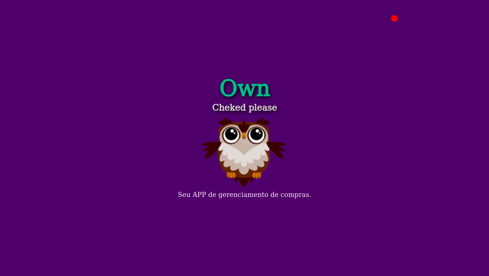
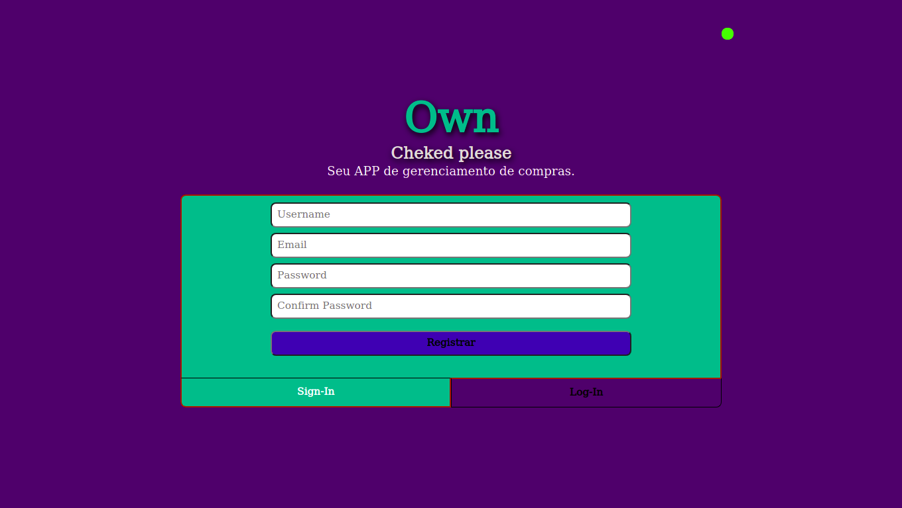
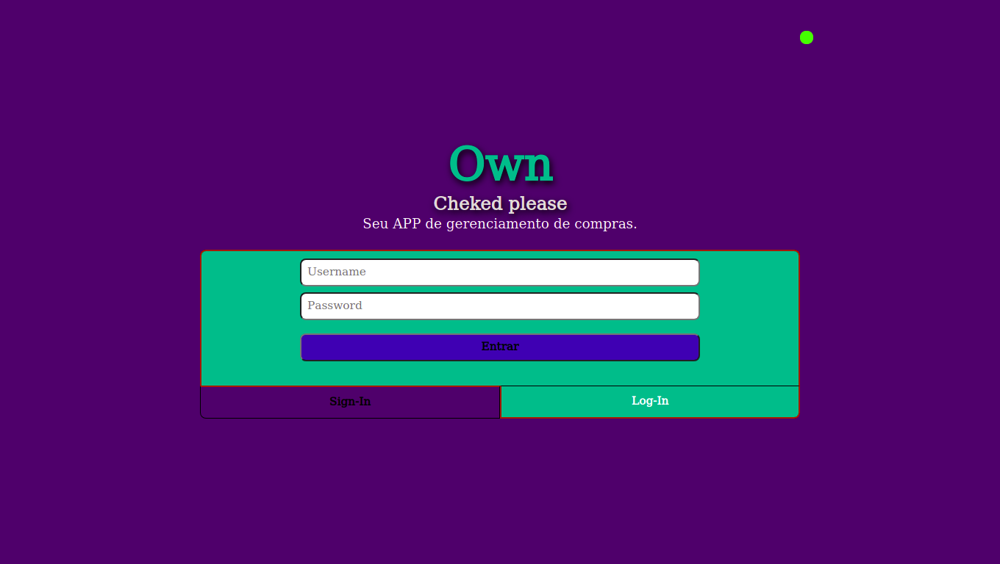
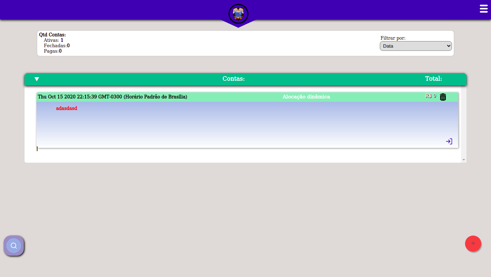
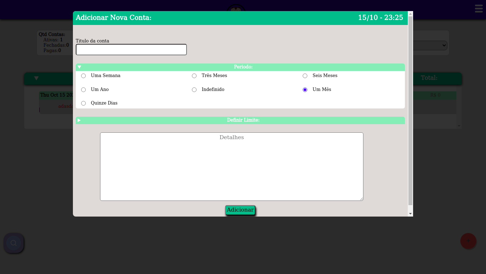
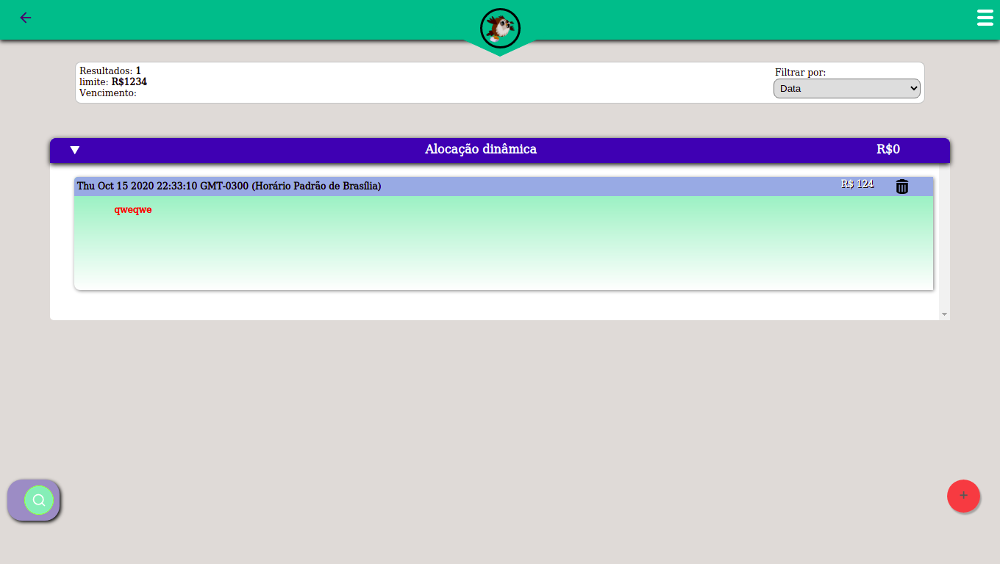

 

# Own Checked Please V2

Sistema de Gerenciamento de Compras segunda versão.

Este sistema foi pensado para o trabalho final de Banco de dados e por esta razão o banco foi implementado em SQLite. Porém para web foi necessário fazer algumas alterações, principalmente no banco para funcionar em mongoDB.

* **Hospedado em:**
    - Versão 1: https://own-cheked.herokuapp.com/ (Estável)
    - Versão 2: https://fathomless-meadow-07431.herokuapp.com/ (erro conecção com o banco)

## Equipe:

Henricky de Lima Monteiro - 475075

Como fiz o trabalho para FBD e a cadeira começou mais cedo, acabei por encerrá-la no meio do semestre, logo boa parte do trabalho estava feita. Por isso, fiz só.

## Objetivos:
O objetivo do sistema foi resolver o problema de compra nos mercadinhos da vizinhança e gerir estas compras com o famoso método do "Fiado".

## Dificuldades: 

As principais dificuldades foram relacionadas em pegar os conhecimentos picotados em todos os trabalhos da cadeira e externos e juntar em um projeto só. No começo é estranho tentar mesclar essas ideias, você acaba cabisbaixo ao ver que não conhece todos os códigos, mas com o tempoa acaba se acostumado a usar a maior parte.

Uma dificuldade foi Converter as ideas de Banco de Dados em SQL para MongoDB, mas muitas facilidades foram percebidas no processo. Outra foi montar os layouts e pensar em como conversar o back-end e o front-end. Até hoje tenho esse bloqueio, porque acabo utilizando o nunjucks para enviar os dados para o html da página, não para os scripts, realmente par ao html, por isso, sinto que a maior dificuldade seria esta.

## Links

* **Drive:** [Vídeo Mostrando o Projeto](https://drive.google.com/file/d/1PQTAl9Dk6QlVMBPEfoBE3hq_lDekgA-O/view?usp=sharing)